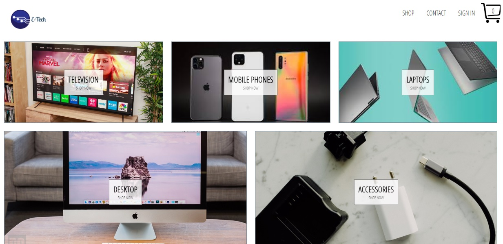

e-tech-shop
================================================

### Introduction
An e-commerce platform built with react.js in the front-end and firebase backend. The has option to view products by category, preview products in a given category, add products to cart and make payment.
### Features

* User registration and authentication
* Display shop products
* Products preview
* Add/remove/delete products to/from the shopping cart
* Checkout and make payment with stripe/paypal.
### Built with

*   React
*   Redux
*   Axios
*   React-router
*   Firebase

### live Demo
https://e-tech-shop.herokuapp.com/

 Getting Started
---------------

### Prerequisites

### Setup

clone the project repo navigate into the project directory; cd e-tech-shop

### Install

install dependencies by running $ npm install

### Usage

run npm start

### Contributions

issues and feature requests are welcome! Feel free to check the issues page. Show your support Give a star if you like this project!

👤 **Author**
Ngodi albert
- Github: [@ngodi](https://github.com/ngodi)
- Twitter: [@albertngodi](https://twitter.com/albertngodi)
- Linkedin: [linkedin](https://www.linkedin.com/in/albertngodi/)

### License

This project is MiT licensed.
